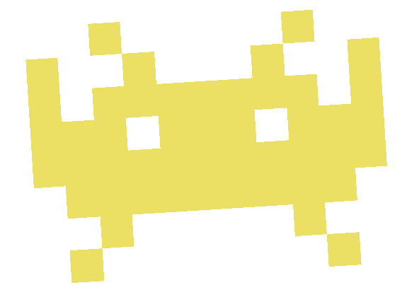
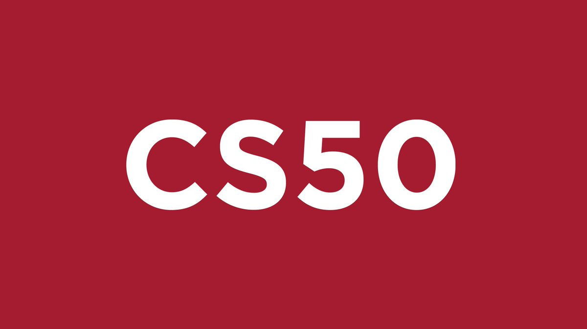
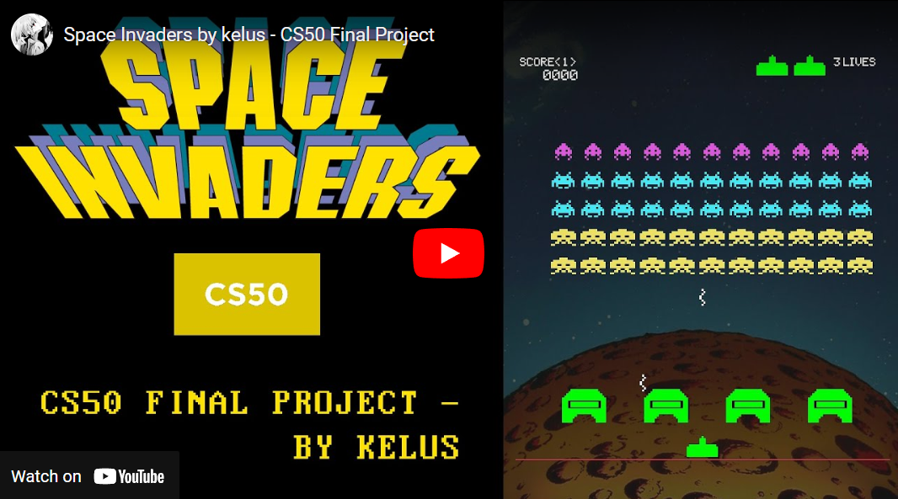
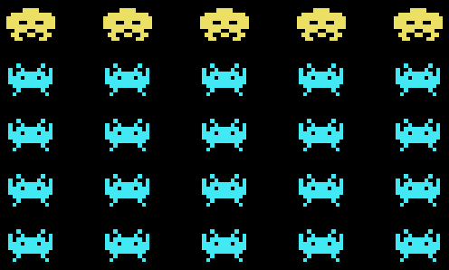
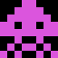
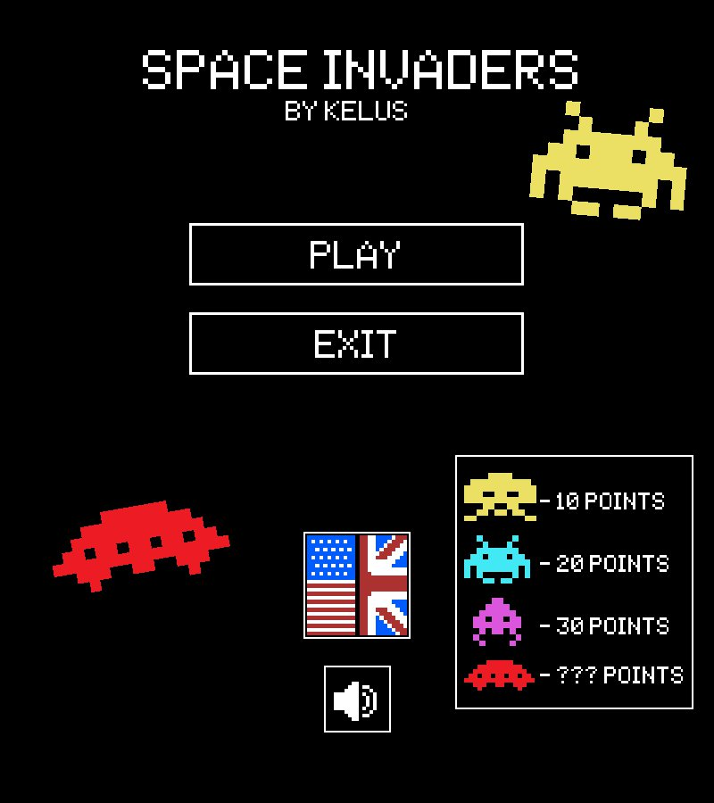
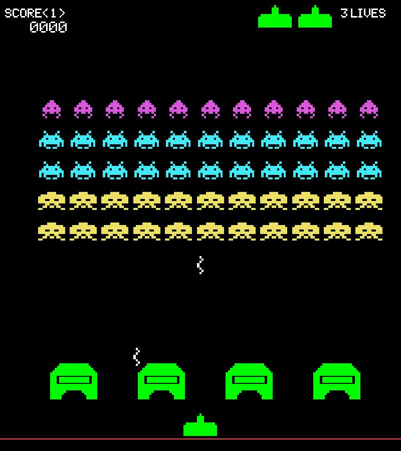

# spaceInvaders
 
# Space Invaders</img>
## _Fan game made by kelus for CS50 Final Project_
</img>

[](https://travis-ci.org/joemccann/dillinger)

### Welcome to my final project
For my CS50 final project, I decided to create a game in python, inspired by the _retro_ videogame called [_Space Invaders_](https://es.wikipedia.org/wiki/Space_Invaders), from 1978.


### Gameplay
[](https://www.youtube.com/watch?v=pLdPxFfJqLU "Space Invaders by kelus - CS50 Final Project")
### Technology
For this project, I used python, along with the _pygame_ package. For the art part, I used some sprites and sounds from the original videogame, but also created other's myself. To reduce the file sizes and structure, I decided to put them all together into a spritesheet.

For the alien wave, I made used a 2 dimentional array, which has each alien's position, life management, animations,... in it. 
You can create your own alien wave by changing `MATRIZ` variable in the code, like in this example:

`MATRIZ = [11,[["C0"],["C1"],["C1"],["P"],["P"]]]` would create the following:


While, for example, `MATRIZ = [5,[["P"],["C1"],["C1"],["C1"],["C1"]]]` would make the alien wave look like this:



```diff
-IMPORTANT: Any non empty matrix will work, as long as it's not too wide and too long, which would make the game instantly crash because of the limited space of the window canvas.
-Also, the game is programmed to work in a 800x900 (width x height) window. Changing this could make the game look and work incorrectly. 
```

### Language features
I really wanted to translate this game into some different languages (it's originally in English, but since it has few words, I decided to translate it).
To make the process easier, I used [_Polyglot Gamedev Project's Language master sheet_](https://docs.google.com/spreadsheets/d/17f0dQawb-s_Fd7DHgmVvJoEGDMH_yoSd8EYigrb0zmM/edit#gid=310116733), which was very helpful. I finally translated the game into:

</img>
>Spanish, English, French, German, Italian, and Portuguese/Brazilian

### Requeriments & execution
As I said before, you will obviously need Python in your computer, along with _pygame_ package, which is already included in the download.
* [Python 3.10.1 (or newer)](https://www.python.org/downloads/)
* [Pygame 2.1.2 (or newer)](https://pypi.org/project/pygame/)

To play the game, go to the game's folder location `"spaceInvaders - by kelus"`, and execute: `python CS50_spaceInvaders_kelus.py`

### How to play
>Controls:
>* **Left & Right arrows (also A & D keys)** - Moves player
>
>* **Space** - Shoots a laser

* You start with 3 lives.
* If you get hit by a laser you will lose 1 life.
* If the aliens get very close to you, the game will be over.
* You get points from killing aliens. The score for each one is:
  *  + **10 POINTS**
  *  + **20 POINTS**
  *  + **30 POINTS**
  *  + **?? POINTS**
* Your objetive in this game is to get the highest amount of points possible.
* If you kill all the aliens, you will continue playing with a new wave, repeatedly until the game is over (once you lose all lives).

### Screenshots & video


### Tools & other sources
* [Aseprite](https://www.aseprite.org/) - Used to modify and create some sprites for the game.
* [Photoshop](https://www.adobe.com/products/photoshop.html) - Used to modify some images and putting all sprites together into a spritesheet.
* [sfxr](https://www.drpetter.se/project_sfxr.html) - Used to create a few sound effects.
* [Audacity](https://github.com/audacity/audacity) - Used to modify (lowering volumes, looping, etc) some sound effects.
* [Polyglot Gamedev Project's Language master sheet](https://docs.google.com/spreadsheets/d/17f0dQawb-s_Fd7DHgmVvJoEGDMH_yoSd8EYigrb0zmM/edit#gid=310116733) - Used to help with the game traduction process.


>Thanks for checking out my project. 😀